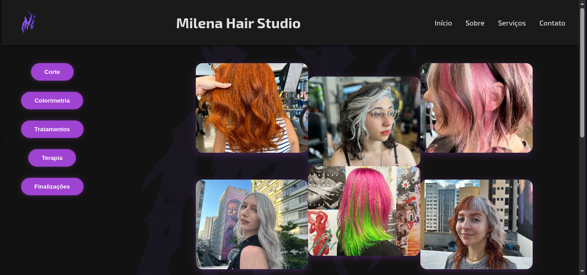
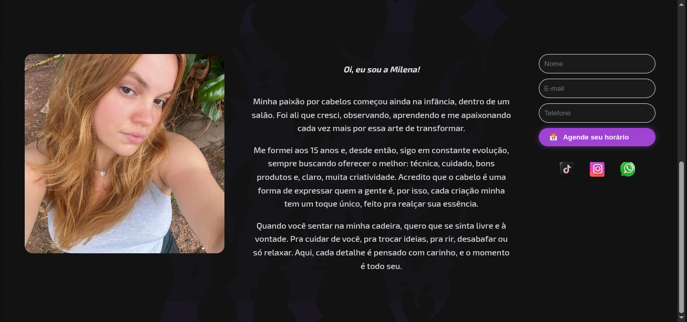

# 💇‍♀️ Milena Hair Studio - Landing Page

Este é um projeto simples de site estático desenvolvido com HTML5 e CSS3, criado como parte de um trabalho acadêmico.

## 🎯 Objetivo

Construir uma landing page moderna e funcional, com foco na apresentação dos serviços e estilo visual do salão Milena Hair Studio.

## 🛠 Tecnologias Utilizadas

- HTML5
- CSS3 (com Flexbox)
- Google Fonts (Exo 2)

## 💡 Layout

O layout foi construído utilizando **Flexbox**, o que permite que os elementos da página se adaptem melhor a diferentes tamanhos de tela, oferecendo um design mais responsivo e moderno.

## 📷 Visual

## 📁 Estrutura do Projeto

site-hair-studio/
├── index.html
├── style.css
├── README.md
├── images/
│ └── (imagens usadas no site)
├── logos/
│ └── (logotipos do projeto)
├── preview/
│ ├── preview_site1.png
│ └── preview_site2.png

